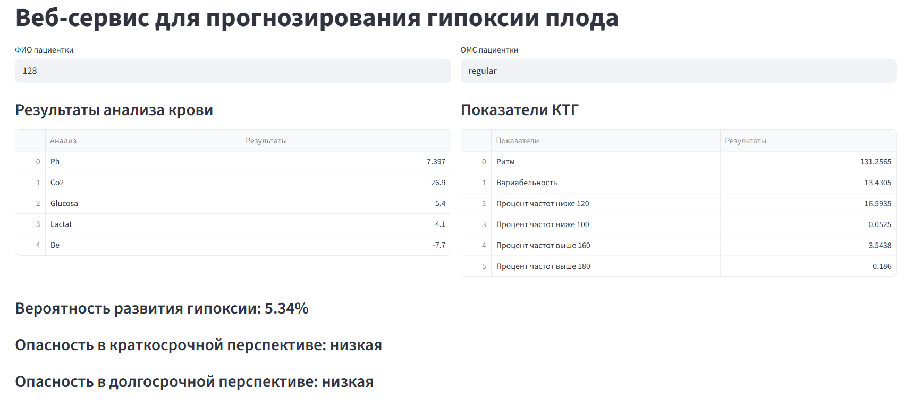

##### ЛЦТ-2025 Задача №3:
##### Веб-сервис предиктивной аналитики физиологических данных с интеграцией в медицинское оборудование

### В данном репозитории представлено решение команды "Ор_11_фей":
- блокнот EDA_and_Train.ipynb с анализом предоставленных датасетов и обучением модели,
- сохраненная предобученная модель: hypoxia_model.cbm
- сохраненные датасеты с обработанными данными: regular_added.csv и hypoxia_added.csv
- скрипт действущего прототипа: prototype_app.py


### Вы можете протестировать работу прототипа на Вашем компьютере
1. Установить requirements

   ```
   $ pip install -r requirements.txt
   ```
2. Запустить приложение

   ```
   $ streamlit run prototype_app.py
   ```
3. Ввести в предложенные поля номер folder из представленного датасета и тип выборки: regular/hypoxia
4. Веб-сервис визуализирует результаты анализа крови пациенток, а также важную статистическую информацию предоставленных КТГ
5. Предобученная модель рассчитывает вероятность гипоксии плода для выбранной пациентки, а на основании данной вероятности строится аналитическое предсказание опасности для плода в краткосрочной и долгосрочной перспективе
